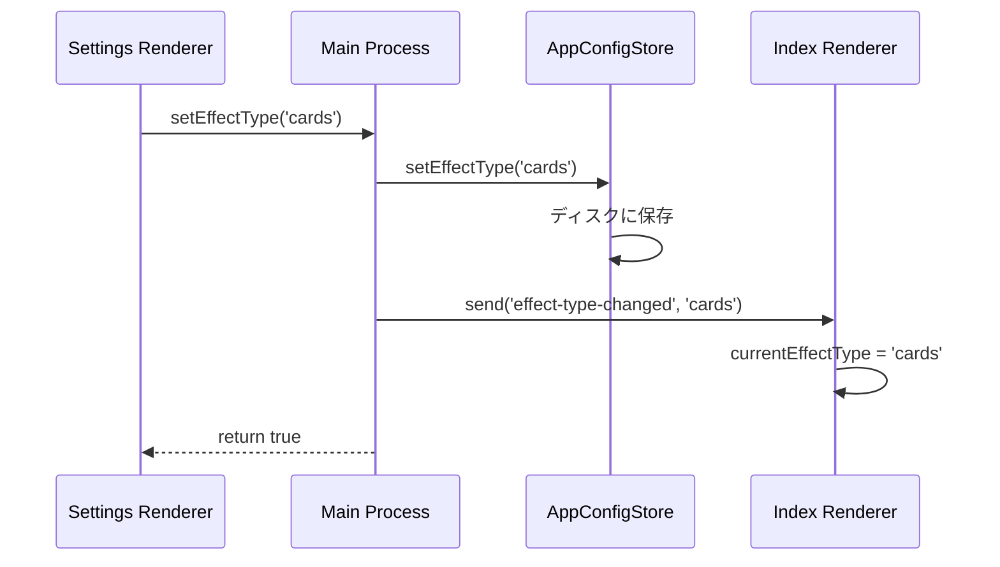

# Electronアーキテクチャ完全理解ガイド

## 🎯 概要

Electronアプリケーションのアーキテクチャについて、Simple Timerプロジェクトを実例に深く学習した内容をまとめます。

## 📋 目次

1. [Electronの基本アーキテクチャ](#electronの基本アーキテクチャ)
2. [プロセス管理とmacOSとの関係](#プロセス管理とmacosとの関係)
3. [IPC通信の仕組み](#ipc通信の仕組み)
4. [メモリ管理とV8エンジン](#メモリ管理とv8エンジン)
5. [トランスパイルとファイル関係](#トランスパイルとファイル関係)
6. [設定変更の伝達フロー](#設定変更の伝達フロー)
7. [実践的な発見](#実践的な発見)

---

## 1. Electronの基本アーキテクチャ

### Electron = Chromium + Node.js

```
Electron Application
├── Main Process (Node.js環境)
│   ├── システム制御・ファイルアクセス
│   ├── ウィンドウ作成・管理
│   └── OS API呼び出し
│
└── Renderer Process (Chromium環境)
    ├── HTML/CSS/JavaScript実行
    ├── DOM操作・UI制御
    └── Web API利用
```

### Simple Timerでの実例

```
src/main/           ← Main Process (Node.js)
├── index.ts        - アプリエントリーポイント
├── IPCHandler.ts   - プロセス間通信制御
├── TimerWindowManager.ts - ウィンドウ管理
└── AppConfigStore.ts - 設定永続化

src/index/          ← Renderer Process (Chromium)
├── index.html      - UI定義
├── renderer.ts     - タイマーロジック
└── functions.ts    - 純粋関数群
```

---

## 2. プロセス管理とmacOSとの関係

### 🔥 重要な発見: ElectronプロセスはmacOSの実プロセス

Electronの「プロセス」は仮想的なものではなく、**実際のmacOSプロセス**として動作します。

#### 実際のプロセス確認
```bash
# Simple Timer実行中のプロセス一覧
ps aux | grep "simple-timer"

# 結果例:
PID 8188 - Main Process (親)
├── PID 8193 - GPU Process  
├── PID 8194 - Network Service Process
├── PID 8195 - Renderer Process (index.html)
├── PID 8196 - Renderer Process (settings.html)
└── PID 8197 - Renderer Process (overlay.html)
```

#### プロセス階層
```
PID 8188 (Main Process) ← 親プロセス
├── PID 8195 (Renderer) ← 子プロセス
├── PID 8196 (Renderer) ← 子プロセス  
└── PID 8197 (Renderer) ← 子プロセス
```

#### 各プロセスの役割詳細

**Main Process (PID 8188)**
- **実行環境**: Node.js
- **権限**: ファイルシステム、OS API、ウィンドウ作成
- **責務**: アプリ全体の制御

**GPU Process (PID 8193)**
- **責務**: グラフィック処理・Canvas描画・CSS効果
- **CPU使用率**: 7.3% (グラフィック処理で高め)
- **Simple Timerでの処理**: 円形プログレスバー、カードアニメーション

**Network Service Process (PID 8194)**
- **責務**: HTTP通信・DNS解決・セキュリティ制御
- **サンドボックス**: `--service-sandbox-type=network`
- **Simple Timerでの処理**: 音声ファイル読み込み、セキュリティ制御

**Renderer Processes (PID 8195, 8196, 8197)**
- **実行環境**: Chromium (各ウィンドウごと)
- **独立性**: それぞれ独立したメモリ空間
- **通信**: 親プロセス(Main)とのみIPC通信可能

---

## 3. IPC通信の仕組み

### プロセス間通信の必要性

Rendererプロセス同士は**直接通信できない**ため、すべてMainプロセス経由で通信します。

### IPC通信パターン

#### パターン1: invoke/handle (双方向通信)
```typescript
// Renderer → Main
await electronAPI.setEffectType('cards');

// preload.ts
setEffectType: (effectType: string) => ipcRenderer.invoke('set-effect-type', effectType)

// Main Process
ipcMain.handle('set-effect-type', async (event, effectType) => {
  await appConfigStore.setEffectType(effectType);
  return true; // ← 戻り値
});
```

#### パターン2: send/on (一方向通信)
```typescript
// Renderer → Main
electronAPI.showCardsCelebration();

// preload.ts  
showCardsCelebration: () => ipcRenderer.send('show-cards-celebration')

// Main Process
ipcMain.on('show-cards-celebration', () => {
  handleCardsCelebration();
});
```

#### パターン3: webContents.send (Main → Renderer)
```typescript
// Main → Renderer
mainWindow.webContents.send('effect-type-changed', effectType);

// Renderer
electronAPI.receive('effect-type-changed', (effectType) => {
  currentEffectType = effectType;
});
```

---

## 4. メモリ管理とV8エンジン

### 🔥 重要な発見: HTMLに変数は存在しない

#### HTMLファイルの役割
```html
<!-- HTMLは静的テンプレートのみ -->
<div id="timerDisplay">03:25</div>  <!-- 初期値のみ -->
<script type="module" src="renderer.js"></script>  <!-- JS読み込み -->
```

#### 変数の実際の管理場所

```
Chromium Renderer Process (PID 8195)
├── HTML Parser Engine
│   └── DOM Tree (HTMLから構築)
│       ├── <div id="timerDisplay">
│       └── <button id="startBtn">
│
├── V8 JavaScript Engine  ← ここで変数管理
│   └── Heap Memory
│       ├── let timeLeft = 180
│       ├── let isRunning = false  
│       └── const timerDisplay = DOMElement
│
└── CSS Engine
    └── Style Sheets
```

#### 変数とDOM要素の相互作用
```javascript
// 1. JavaScript変数 (V8 Heap)
let timeLeft = 180;

// 2. DOM要素参照 (DOM Tree)  
const timerDisplay = document.getElementById('timerDisplay');

// 3. 変数の値をDOM要素に反映
timerDisplay.textContent = formatTime(timeLeft); // "03:00"
```

### 複数JSファイルでの1つのV8エンジン

#### 重要な発見: 1つのHTML = 1つのV8エンジン

複数のJSファイルを読み込んでも、**1つのV8エンジン**で管理されます。

```html
<!-- 複数JSファイル読み込み例 -->
<script type="module" src="renderer.js"></script>
<script type="module" src="functions.js"></script>
<script type="module" src="timer-logic.js"></script>
```

#### V8エンジン内でのモジュール管理
```
V8 JavaScript Engine (1つのエンジン)
├── Module Registry
│   ├── './renderer.js' → Module Object
│   ├── './functions.js' → Module Object
│   └── './timer-logic.js' → Module Object
│
├── Execution Context Stack
│   ├── Global Context
│   ├── renderer.js Context
│   └── functions.js Context
│
└── Heap Memory
    ├── renderer.js variables (let timeLeft = 180)
    ├── functions.js variables (formatTime function)
    └── 共有参照 (import/export bindings)
```

---

## 5. トランスパイルとファイル関係

### TypeScript → JavaScript の変換フロー

#### 開発時のファイル構造
```
src/index/
├── index.html          ← HTMLファイル (開発時)
├── renderer.ts         ← TypeScriptファイル (開発時)
└── functions.ts        ← TypeScriptファイル (開発時)
```

#### ビルド後のファイル構造
```
dist/renderer/
├── renderer.js         ← トランスパイル後 (実行時)
└── functions.js        ← トランスパイル後 (実行時)
```

#### HTMLからの参照
```html
<!-- src/index/index.html -->
<script type="module" src="index.js"></script>
                          ^^^^^^^^
                          トランスパイル後のJSファイルを参照
```

### トランスパイル変換例

#### TypeScript (元ファイル)
```typescript
// src/index/renderer.ts
let timeLeft: number = 3 * 60;           // ← 型注釈あり
let timerInterval: number | null = null; // ← Union型
```

#### JavaScript (トランスパイル後)
```javascript
// dist/renderer/renderer.js
let timeLeft = 3 * 60;          // ← 型注釈削除
let timerInterval = null;       // ← Union型削除
```

### なぜdist/を参照するのか？

1. **ブラウザはTypeScriptを理解できない**
2. **モジュール解決**: ES6 modules として実行
3. **最適化**: 型チェック → トランスパイル → 最適化

---

## 6. 設定変更の伝達フロー

### Settings Renderer → 他Rendererへの伝達

Rendererプロセス同士は直接通信できないため、**Mainプロセス経由**で設定変更を伝達します。

#### 完全なフロー図


#### 具体的なコード実装

**1. Settings Renderer → Main Process**
```javascript
// settings.html
async function selectEffect(effectType) {
    await electronAPI.setEffectType(effectType);
}
```

**2. Main Process → 永続化 + 通知**
```typescript
// IPCHandler.ts
ipcMain.handle('set-effect-type', async (event, effectType) => {
  // 永続化
  await this.appConfigStore.setEffectType(effectType);
  
  // 他Rendererに通知
  const timerWindow = this.timerWindowManager.getWindow();
  timerWindow.webContents.send('effect-type-changed', effectType);
  
  return true;
});
```

**3. Index Renderer → ローカル変数更新**
```javascript
// renderer.js
electronAPI.receive('effect-type-changed', (effectType) => {
    currentEffectType = effectType;
});
```

---

## 7. 実践的な発見

### CommonJS vs ES6 Modules の使い分け

#### Main Process = CommonJS
```typescript
// tsconfig.main.json
{ "module": "commonjs" }

// 理由: Node.jsエコシステムとの互換性
const { app, BrowserWindow } = require('electron');
```

#### Renderer Process = ES6 Modules  
```typescript
// tsconfig.renderer.json
{ "module": "ES6" }

// 理由: モダンブラウザの標準、Tree shakingサポート
import { formatTime } from './functions.js';
```

### preload.tsのセキュリティ境界

#### contextBridgeの役割
```typescript
// preload.ts
contextBridge.exposeInMainWorld('electronAPI', {
  setEffectType: (effectType) => ipcRenderer.invoke('set-effect-type', effectType)
});

// サンドボックス化されたRendererでNode.js APIを安全に使用
```

### プロセス分離によるメリット

#### クラッシュ耐性
```bash
# GPU Processがクラッシュしても
kill -9 8193

# → Mainプロセスは継続稼働
# → 他のRendererプロセスも継続稼働  
# → アプリは動作し続ける
```

#### パフォーマンス分散
```
CPU使用率の分散:
├── Main Process: 0.5% (ロジック処理)
├── GPU Process: 7.3% (グラフィック処理)
├── Network Service: 0.0% (ネットワーク処理)
└── Renderer Processes: 0.1-0.4% (UI処理)
```

---

## 🎯 まとめ

### 学習した核心概念

1. **実プロセス**: ElectronプロセスはmacOSの実際のプロセス
2. **プロセス分離**: セキュリティ・安定性・パフォーマンス向上
3. **IPC通信**: プロセス間の唯一の通信手段
4. **メモリ分離**: HTML=静的、JS変数=V8ヒープで管理
5. **1エンジン多モジュール**: 1つのHTML=1つのV8エンジン
6. **設定伝達**: Main経由のブロードキャスト方式

### 実践的な応用価値

- **デバッグ効率**: プロセス分離により問題の特定が容易
- **パフォーマンス最適化**: 各プロセスの役割を理解した最適化
- **セキュリティ設計**: サンドボックスとIPC通信の適切な活用
- **アーキテクチャ設計**: スケーラブルなElectronアプリ構築

この知識により、Electronアプリケーションの**内部構造を完全に理解**し、効率的な開発・デバッグ・最適化が可能になります。

---

*Simple Timer プロジェクトでの実践学習 - 2025年7月*